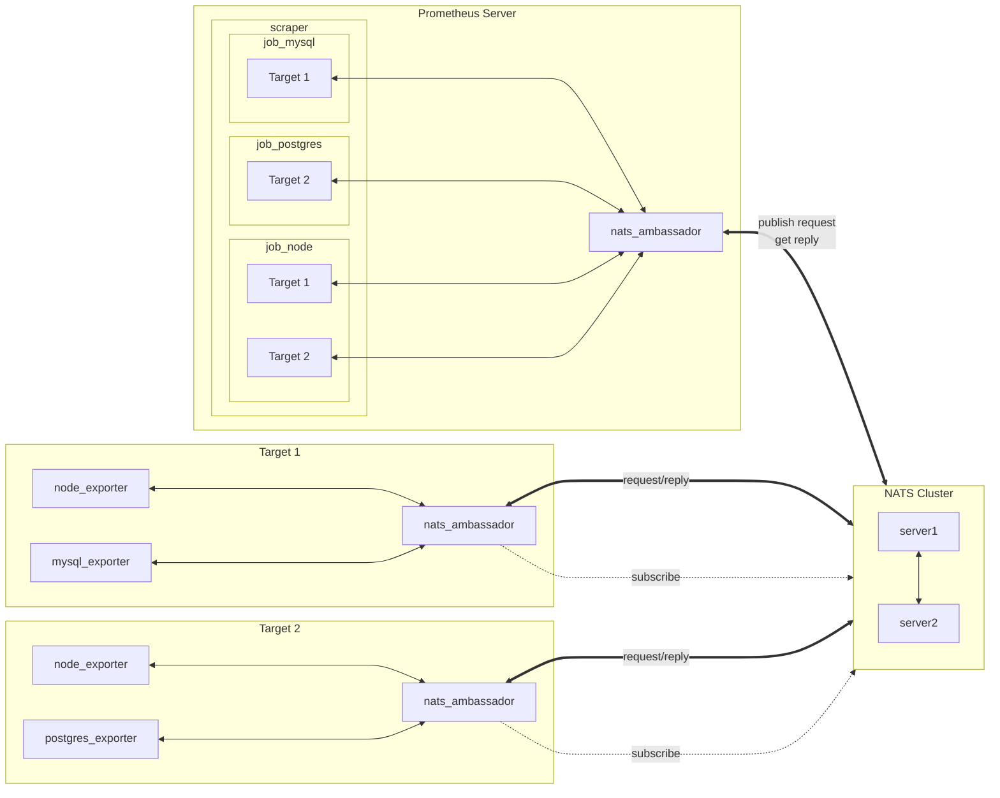

# Prometheus NATS Ambassador

[[_TOC_]]

# Introduction

> **NOTE:** WIP code not production ready

Ambassador microservice[^ambassador-microservice] to handle the communication
with a NATS[^nats-io] message bus. Provides a generic interface for Prometheus
to scrape exporter data that may be located behind firewalls or private
networks.

Other more flexible solutions to solve this problem exists, however was looking
for something small and lightwight with very minimal setup and dependancies.

Similar idea as PushProx[^pushprox] and Kafka Adapter[^kafka-adapter] but with
NATS as the backend messaging system using it's Request/Reply feature versus the
remote write feature used by the Kafka Adapter[^kafka-adapter].

References:
 - https://prometheus.io/docs/concepts/data_model/
 - https://github.com/prometheus/prometheus/wiki/Default-port-allocations
 - https://github.com/golang-standards/project-layout
 - https://docs.dapr.io/


# System Design

Example diagram showing targets behind a network and connecting out to a NATS
system to communicate.



# Install Requirements

System modules required to be install on OS to complete install and run the
application is Go build tools, details can be found for your platform here.

 - Go build tools - https://go.dev/
 - Existing Prometheus scrapper - https://prometheus.io/
 - Existing NATS system - https://nats.io/

## Build Steps (manual)

1. Clone repo

   ```
   git clone <this repo url>
   ```

2. Change into cloned repos directory

   ```
   cd <this repo name>
   ```

3. Build go binaries with the following command, this will place files in the
   `bin/*` directory.

   ```
   make build
   ```

   > NOTE The `Makefile` build will override the `GOBIN` environment to force
   > install of binaries into the `bin/*` directory. The `make` process will
   > look for `cmd/*/main.go` and create binary named after the directory.

4. Run script after configuration (detailed below)

# Prometheus Scrape Configuration

## Example Static configuration

Below is a simple configuration with a per-proxy configuration for the
`prometheus.yml` file used by Prometheus server/collector. The metrics path
used by the Prometheus NATS Ambassador is `/proxy`.

> NOTE: If you want to use TLS on the `proxy_url` then put `nats_ambassador`
> behind a reverse proxy.

```yaml
  # https://prometheus.io/docs/prometheus/latest/configuration/configuration/#scrape_config
  # Each job name must be unique
  - job_name: "nats_node_targets"
    # Set metrics pull path for NATS Ambassador running locally
    proxy_url: http://localhost:8080/
    metrics_path: /proxy

    static_configs:
      - labels:
          # Override the "job" label.
          job: nats_node
        targets:
          - target1.example.com:9100
          - target2.example.com:9100

  - job_name: "nats_node_remote_tls"
    # Set metrics pull path for NATS Ambassador via TLS behind a reverse proxy
    proxy_url: https://remotes.example.com:8080/
    metrics_path: /proxy

    static_configs:
      - labels:
          # Override the "job" label.
          job: nats_node
        targets:
          - target3.example.com:9100
```

## Example Service Discovery configuration (alternate)

An alternative configuration method with service discovery option.

Service discovery with regards to target configuration has some limitations
with what can be set.

> Note that the `proxy_url` cannot be set dynamically in the targets
> file[^per-target-proxy].

```yaml
  # https://prometheus.io/docs/prometheus/latest/configuration/configuration/#scrape_config
  # Each job name must be unique
  - job_name: "nats_node_exporter_service_discovery"

    # Set metrics pull path for NATS Ambassador
    proxy_url: http://localhost:8080/
    metrics_path: /proxy

    file_sd_configs:
      - files:
          - '/opt/prometheus/config/targets_exporter.json'
```

### File Service Discovery Example

File: `targets_exporter.json`
```json
[
  {
    "targets": [
      "target1.example.com:9100"
    ],
    "labels": {
      "job": "nats_node"
    }
  },
  {
    "targets": [
      "target2.example.com:9100"
    ],
    "labels": {
      "job": "nats_node"
    }
  },
  {
    "targets": [
      "target2.example.com:9187"
    ],
    "labels": {
      "job": "nats_postgres"
    }
  }
]
```

# NATS Ambassador Configuration Checklist

Listing of configuration items before application can be started.

## NATS Credentials

Should use NATS credentials introduced in NATS 2.0, refer to the link below.

References:
 - https://docs.nats.io/using-nats/developer/connecting/creds

## NATS Subjects

NATS communication is via publish/subscribe subjects (also known as topics). By
default the NATS Ambassador will use the base subject `io.prometheus.exporter.`
when building the publishing requests.

> Note the `.` at the end when defining base subject, refer to template below.

If something else is desired for your setup, this can be changed via CLI option
`-subjbase`. This document we'll use the default base subject of
`io.prometheus.exporter.`.

In light of NATS subject[^nats-naming] naming requirements, the system will
default replace the incoming hostname `.` with `_`. This is to limit the number
of sub-levels and for now to keep it one subject per-target/host. If you do not
want this behaviour set `-subjfmt` to `fwd` or `rev`. The exporter is defined
by the port requested and referenced to Prometheus default port
allocations[^prom-ports].

Example:
 - Hosts:
    - `target1.example.com`
 - NATS Subject:
    - Template: `<base subject><host>.<port of exporter>`
    - Default: `io.prometheus.exporter.target1_example_com.9100`
    - `fwd` Format: `io.prometheus.exporter.target1.example.com.9100`
    - `rev` Format: `io.prometheus.exporter.com.example.target1.9100`

## Setup `subscriptions.json`

Define NATS subscriptions for Prometheus exporters and the endpoint to pull
from once the request is received. One or more array of objects can be set,
this JSON format is defined by the programmatic approached documented by the
dapr programmatic subscription method[^dapr-sub]. The **topic** JSON key should
match what was set above for subject base and format.

```json
[
  {
    "pubsubname": "node_exporter",
    "topic": "io.prometheus.exporter.target1_example_com.9100",
    "route": {
      "default": "http://target1.localnet:9100/metrics",
      "rules": []
    }
  },
  {
    "pubsubname": "node_exporter",
    "topic": "io.prometheus.exporter.target2_example_com.9100",
    "route": {
      "default": "http://target1.localnet:9100/metrics",
      "rules": []
    }
  }
]
```

> NOTE: the JSON keys for route rules are ignored currently.

# Startup

Once all files are configured, the script can be started up. There are 2 modes
that can be started up as, with or without a `subscriptions.json` file.

## Method 1 (Scraper + Exporter)

 - Purpose:
    - Connect to NATS message bus and provide HTTP interface for Prometheus
      scraper and to listen for NATS requests on subscribed subjects for
      exporter response.
 - Usage:
   ```sh
   nats_ambassador -creds /nats/cred/file/user.creds \
     -urls nats://nats.example.com:4222 \
     -subs /sub/file/loc/subscriptions.json \
     -listen localhost:8080
   ```

## Method 2 (Scraper only)

 - Purpose:
    - Connect to NATS message bus and provide HTTP interface for Prometheus
      scraper.
 - Usage:
   ```sh
   nats_ambassador -creds /nats/cred/file/user.creds \
     -urls nats://nats.example.com:4222 \
     -listen localhost:8080
   ```

Tests - *TODO*
--------------

Testing files will be located in `cmd/<app>/main_test.go`, need to include CI
setup where a NATS server is setup with docker or other means automatically.
For now only testing if version is proper semver.

[^ambassador-microservice]: https://learn.microsoft.com/en-us/azure/architecture/patterns/ambassador
[^pushprox]: https://github.com/prometheus-community/PushProx
[^kafka-adapter]: https://github.com/Telefonica/prometheus-kafka-adapter
[^nats-io]: https://github.com/nats-io/nats.go
[^dapr-sub]: https://docs.dapr.io/developing-applications/building-blocks/pubsub/subscription-methods/#programmatic-subscriptions
[^nats-naming]: https://github.com/nats-io/nats-architecture-and-design/blob/main/adr/ADR-6.md
[^prom-ports]: https://github.com/prometheus/prometheus/wiki/Default-port-allocations
[^per-target-proxy]: https://github.com/prometheus/prometheus/issues/9074#issuecomment-887616786